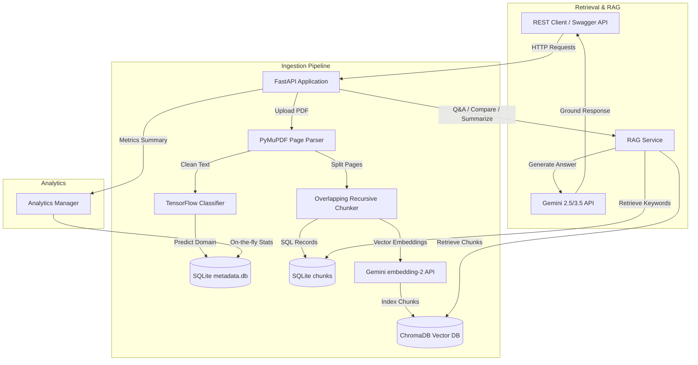

# AI Research & Knowledge Assistant

A production-grade, enterprise-ready backend application built with FastAPI, TensorFlow, and ChromaDB. It automates the processing of unstructured PDF documents, auto-classifies their research domain, generates semantic/keyword/hybrid indexes, and supports context-grounded Retrieval-Augmented Generation (RAG) with precise citations and conversational memory.

---

## 1. Project Overview

Organizations manage hundreds of research papers, internal docs, and product specifications. Finding accurate information from them is slow, and traditional search engines lack conceptual understanding. Furthermore, general LLMs often hallucinate facts when queried on specialized domains.

This application implements a secure, local pipeline to solve this. It provides:
- **Ingestion & Tracking**: PDF text parsing, status management, page-level tracking.
- **Intelligent Classification**: Custom TensorFlow model classifies papers into domains (e.g. NLP, Computer Vision, Cloud Computing).
- **Hybrid Search**: Fuses SQLite Full-Text Keyword Search with ChromaDB semantic vector search.
- **Citation RAG**: Gemini-powered Q&A returning exact document page citation mappings.
- **Analytics**: Real-time stats on documents, chunk metrics, query distributions, and top queried materials.

---

## 2. Architecture Diagram



---

## 3. Technology Stack

- **Core Framework**: `FastAPI` (version `0.136.0`)
- **Web Server**: `Uvicorn` (version `0.44.0`)
- **Document Processing**: `PyMuPDF` (`fitz`, version `1.28.0`)
- **Vector Database**: `ChromaDB` (version `1.5.9`)
- **Embedding & LLM APIs**: `google-genai` (version `2.6.0`) using `gemini-embedding-2` and `gemini-2.5-flash`
- **Machine Learning**: `TensorFlow` / `Keras` (version `2.21.0`)
- **Relational Metadata Store**: `SQLAlchemy` (version `2.0.49`) with `SQLite`

---

## 4. Setup & Running Instructions

### 4.1 Prerequisites
- **Python**: `3.10` or `3.11` (also fully compatible with `3.12`)
- **API Key**: A Gemini API Key is required. Set it in a `.env` file in the project root or in your home directory (`~/.env`).

### 4.2 Installation

1. Clone or download this repository.
2. Initialize virtual environment:
   ```bash
   python -m venv venv
   source venv/bin/activate  # On Windows: venv\Scripts\activate
   ```
3. Install dependencies:
   ```bash
   pip install -r requirements.txt
   ```
4. Copy the environment variables example and configure the key:
   ```bash
   cp .env.example .env
   ```
   Modify `.env` and set `GEMINI_API_KEY=your_key_here`.

### 4.3 Training & Launching

1. On server startup, the application automatically detects if the classifier model file `models/tf_classifier.h5` exists. If it is missing, it **automatically runs the TensorFlow training script** on a synthetic scientific dataset of abstracts to establish a baseline model.
2. Start the FastAPI server:
   ```bash
   uvicorn main:app --reload --host 127.0.0.1 --port 8000
   ```
3. Open your browser and navigate to the interactive Swagger docs:
   - **Swagger UI**: [http://127.0.0.1:8000/docs](http://127.0.0.1:8000/docs)
   - **ReDoc**: [http://127.0.0.1:8000/redoc](http://127.0.0.1:8000/redoc)

### 4.4 Running Automated Tests

Run the test suite checking parser, chunking, tensorflow compilation, and API routes mocks:
```bash
python -m pytest
```

---

## 5. Environment Variables

| Variable | Description | Default |
| --- | --- | --- |
| `GEMINI_API_KEY` | Google Gemini API Key | *(Required)* |
| `DATABASE_URL` | SQLite Connection URI | `sqlite:///data/assistant.db` |
| `DEBUG` | Turn on FastAPI verbose logging | `True` |

---

## 6. API Documentation

### 6.1 Document Management

#### Upload PDF
- **Endpoint**: `POST /documents/upload`
- **Request Body**: Multipart form data with file field `file`.
- **Response**:
  ```json
  {
    "message": "Document uploaded and scheduled for processing successfully.",
    "doc_id": "90e29b1d-72ee-4447-b8d4-5fe5c862413e",
    "file_name": "nlp_paper.pdf",
    "processing_status": "PENDING"
  }
  ```

#### List Documents
- **Endpoint**: `GET /documents`
- **Response**:
  ```json
  [
    {
      "doc_id": "90e29b1d-72ee-4447-b8d4-5fe5c862413e",
      "file_name": "nlp_paper.pdf",
      "upload_timestamp": "2026-07-28T07:35:00.123456",
      "total_pages": 2,
      "total_chunks": 4,
      "processing_status": "PROCESSED",
      "category": "Natural Language Processing"
    }
  ]
  ```

#### Delete Document
- **Endpoint**: `DELETE /documents/{doc_id}`
- **Response**:
  ```json
  {
    "message": "Document 'nlp_paper.pdf' deleted successfully."
  }
  ```

---

### 6.2 Semantic Search & Q&A

#### Semantic, Keyword or Hybrid Retrieval
- **Endpoint**: `POST /search/query`
- **Request Parameters**:
  ```json
  {
    "query": "transformer architectures for text translation",
    "search_mode": "hybrid",
    "doc_ids": ["90e29b1d-72ee-4447-b8d4-5fe5c862413e"],
    "k": 2
  }
  ```
- **Response**:
  ```json
  [
    {
      "chunk_id": "90e29b1d-72ee-4447-b8d4-5fe5c862413e_c0",
      "text": "This paper describes a novel transformer-based neural network architecture for Natural Language Processing...",
      "metadata": {
        "doc_id": "90e29b1d-72ee-4447-b8d4-5fe5c862413e",
        "file_name": "nlp_paper.pdf",
        "page_number": 1,
        "chunk_index": 0
      },
      "score": 0.0328
    }
  ]
  ```

#### Citation-Grounded RAG with Memory
- **Endpoint**: `POST /search/qa`
- **Request Parameters**:
  ```json
  {
    "query": "what translation benchmark did they test?",
    "session_id": "user-session-123",
    "search_mode": "hybrid",
    "doc_ids": ["90e29b1d-72ee-4447-b8d4-5fe5c862413e"],
    "k": 4
  }
  ```
- **Response**:
  ```json
  {
    "answer": "The authors evaluated their model on English-Spanish machine translation benchmarks.",
    "citations": [
      {
        "document_name": "nlp_paper.pdf",
        "page_number": 1
      }
    ],
    "retrieved_context": [
      "This paper describes a novel transformer-based neural network architecture..."
    ],
    "confidence_score": 0.95
  }
  ```

---

### 6.3 Document Analysis

#### Summarize Document
- **Endpoint**: `POST /analysis/summarize`
- **Request Body**:
  ```json
  {
    "doc_id": "90e29b1d-72ee-4447-b8d4-5fe5c862413e"
  }
  ```
- **Response**:
  ```json
  {
    "doc_id": "90e29b1d-72ee-4447-b8d4-5fe5c862413e",
    "file_name": "nlp_paper.pdf",
    "executive_summary": "A detailed high-level summary here...",
    "technical_summary": "Deep dive into layers, attention keys, vocabulary...",
    "bullet_points": [
      "Introduces multi-head attention",
      "Tests English-Spanish corpus translation"
    ],
    "key_takeaways": [
      "Replacing recurrences with attention improves scalability."
    ]
  }
  ```

#### Compare Multiple Documents
- **Endpoint**: `POST /analysis/compare`
- **Request Body**:
  ```json
  {
    "doc_ids": [
      "90e29b1d-72ee-4447-b8d4-5fe5c862413e",
      "512a21bc-12aa-44fa-11aa-5fe5c8623b32"
    ]
  }
  ```
- **Response**:
  ```json
  {
    "compared_documents": [
      {"doc_id": "90e29b1d-72ee-4447-b8d4-5fe5c862413e", "file_name": "nlp_paper.pdf"},
      {"doc_id": "512a21bc-12aa-44fa-11aa-5fe5c8623b32", "file_name": "cloud_paper.pdf"}
    ],
    "methodologies_comparison": "NLP uses Transformers. Cloud uses Kubernetes auto-scalers...",
    "advantages_disadvantages": "Pros and cons of cloud scaling vs transformer constraints...",
    "similarities": ["Both papers target system latency optimization."],
    "differences": ["Domain-specific applications: text sequences vs virtual clusters."],
    "conclusions_comparison": "Contrasting conclusions...",
    "implementation_approaches": "REST orchestration vs containerized microservices...",
    "comparison_matrix_markdown": "| Aspect | Paper A | Paper B |\n| --- | --- | --- |\n| Target | Text Translation | Auto-scaling |"
  }
  ```

---

### 6.4 Analytics

#### Fetch Usage Statistics
- **Endpoint**: `GET /analytics`
- **Response**:
  ```json
  {
    "total_documents": 2,
    "total_processed_chunks": 8,
    "total_embeddings_generated": 8,
    "total_questions_answered": 15,
    "categories_distribution": {
      "Natural Language Processing": 1,
      "Cloud Computing": 1
    },
    "most_queried_documents": [
      {
        "doc_id": "90e29b1d-72ee-4447-b8d4-5fe5c862413e",
        "file_name": "nlp_paper.pdf",
        "reference_count": 8
      }
    ]
  }
  ```

---

## 7. Assumptions & Design Decisions

1. **Gemini SDK Choice**: The application uses the modern `google-genai` Python library rather than the deprecated `google-generativeai` SDK.
2. **SQLite & ChromaDB Co-existence**: SQLite stores transactional metadata, chunks (providing robust schema definitions), and conversation sessions. ChromaDB holds vector embeddings of size 3072, linking back to SQLite via document UUIDs.
3. **Structured Outputs**: Instead of loose text formatting and regex parse chains for citations, the RAG API uses Gemini's native JSON schema compliance (`response_schema`). This guarantees the backend output matches the requested format.
4. **TF-IDF Keyword Search in Python**: FTS5 in SQLite compilation settings can vary. To ensure 100% platform-independent keyword indexing and fast performance, a clean Python-based TF-IDF ranker was built.
5. **Keras 3 Tensor Conversion**: Keras 3 with a TensorFlow backend requires explicit typing. To prevent optree string dtype mismatches, text inputs to `adapt()`, `fit()`, and `predict()` are converted into `tf.string` tensors.

---

## 8. Limitations & Future Improvements

- **Scale limits**: The SQLite local DB and in-process ChromaDB operate locally. For multi-node high availability, moving to PostgreSQL (for metadata) and Qdrant/Milvus (for vector store clustering) is recommended.
- **Async Workers**: Heavy ingestion currently runs in FastAPI's background thread pool. Under massive traffic, introducing task queues like Celery with Redis is suggested.
- **Multilingual OCR**: For scanned PDFs, integrating PyTesseract or Google Cloud Vision OCR would handle image-based pages.
